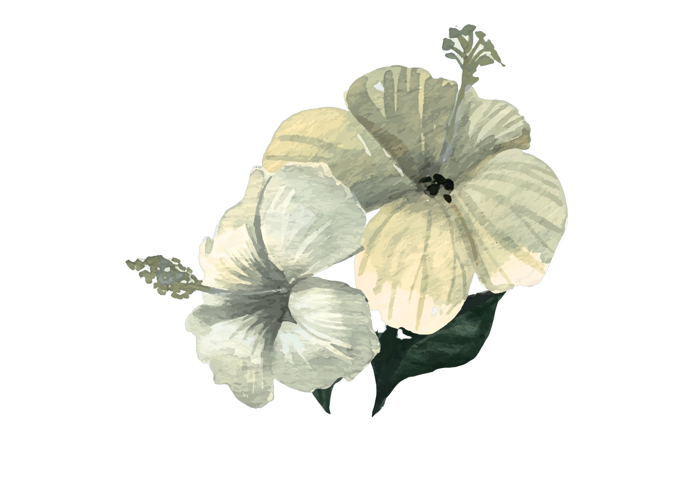

Have a project idea? Fill out the [Request Project Idea Form](jaydenmerrick.bio) to have your idea listed below!

::: {.grid}

::: {.g-col-12}
::: {.card-box .project-card}
### CNN Model Analyzing non-coding DNA for Cancer
<mark>Currently Ongoing</mark> <mark>Python</mark> <mark>Machine Learning</mark>

Using Supervised training for a CNN to analyze large DNA datasets, specifically the non-coding DNA sequences, to discover possible patterns that result in Melanomia cancer.

<!-- GitHub logo & Link -->
<a href="https://github.com/JaydenJMerrick/biodata-ecosystem">
  <i class="bi bi-github"> GitHub Repository</i>
</a>

**Author(s):**
[Jayden Merrick](JaydenMerrick.bio)

<!-- Corner Flower png -->
{.corner-img-right .corner-img}
:::
:::

::: {.g-col-12}
::: {.card-box .project-card}
### Madison Lakeshore Preserve Biodiversity Trends Map
<mark>Project Idea</mark> <mark>Statistical Trends</mark> <mark>Mapping</mark> 

Lakeshore preserve plant data, collect by a local organization, that is mapped to display possible future trends for the biodiversity of the area.

<!-- Corner Flower png -->
{.corner-img-left .corner-img}
:::
:::

::: {.g-col-12}
::: {.card-box .project-card}
### UW Arboretum Invasive Species Mapping
<mark>Project Idea</mark> <mark>Mapping</mark> 

Uses INaturalist data and API to map out the invasive Buckthorn and Garlic Mustard with a spatial distribution model. This can directly act as actionable conservation data.

<!-- Corner Flower png -->
{.corner-img-right .corner-img}
:::
:::

::: {.g-col-12}
::: {.card-box .project-card}
### Species Nucleotide Count Comparisons 
<mark>Project Idea</mark> <mark>R</mark>

Counting and plotting the percentages of each nucleotide of differing species using a DNA FASTA file. Uses Chargaff's rules to justify counting two bases. Data can be from Ensembl.

<!-- Corner Flower png -->
{.corner-img-left .corner-img}
:::
:::

::: {.g-col-12}
::: {.card-box .project-card}
### Comparative Genomics of Disease Resistance (NLR) Genes 
<mark>Project Idea</mark> <mark>R</mark>

Catalog and compare Nucleotide-Binding Leucine-Rich Repeat (NLR) immune receptor genes across wild and domesticated plant relatives. Data can be sources from  NCBI GenBank genome assemblies. 

<!-- Corner Flower png -->
{.corner-img-right .corner-img}
:::
:::

:::
